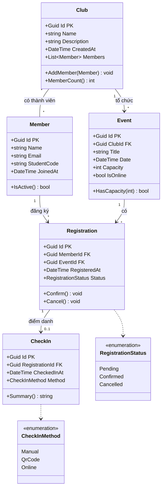

# Class Diagram - EduHub

```mermaid
classDiagram
    class Club {
        +Guid Id PK
        +string Name
        +string Description
        +DateTime CreatedAt
        +List~Member~ Members
        +AddMember(Member) void
        +MemberCount() int
    }
    class Member {
        +Guid Id PK
        +string Name
        +string Email
        +string StudentCode
        +DateTime JoinedAt
        +IsActive() bool
    }
    class Event {
        +Guid Id PK
        +Guid ClubId FK
        +string Title
        +DateTime Date
        +int Capacity
        +bool IsOnline
        +HasCapacity(int) bool
    }
    class Registration {
        +Guid Id PK
        +Guid MemberId FK
        +Guid EventId FK
        +DateTime RegisteredAt
        +RegistrationStatus Status
        +Confirm() void
        +Cancel() void
    }
    class CheckIn {
        +Guid Id PK
        +Guid RegistrationId FK
        +DateTime CheckedInAt
        +CheckInMethod Method
        +Summary() string
    }
    class RegistrationStatus {
        <<enumeration>>
        Pending
        Confirmed
        Cancelled
    }
    class CheckInMethod {
        <<enumeration>>
        Manual
        QrCode
        Online
    }

    Club "*" -- "*" Member : có thành viên
    Club "1" --> "*" Event : tổ chức
    Member "1" --> "*" Registration : đăng ký
    Event "1" --> "*" Registration : có
    Registration "1" --> "0..1" CheckIn : điểm danh
    Registration ..> RegistrationStatus
    CheckIn ..> CheckInMethod
```